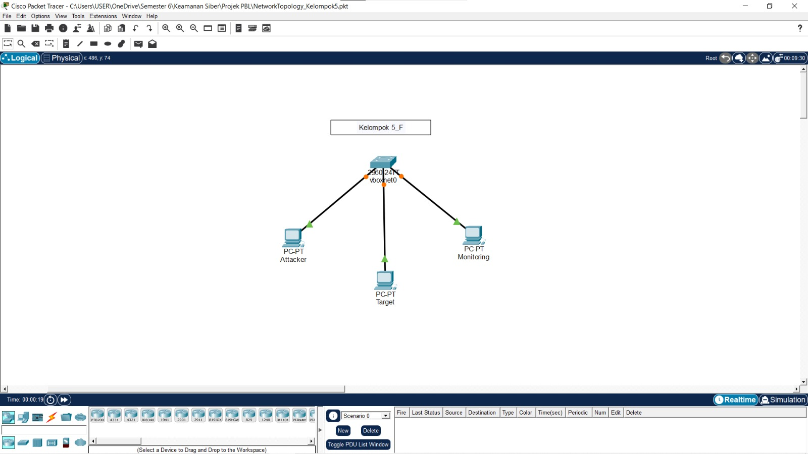
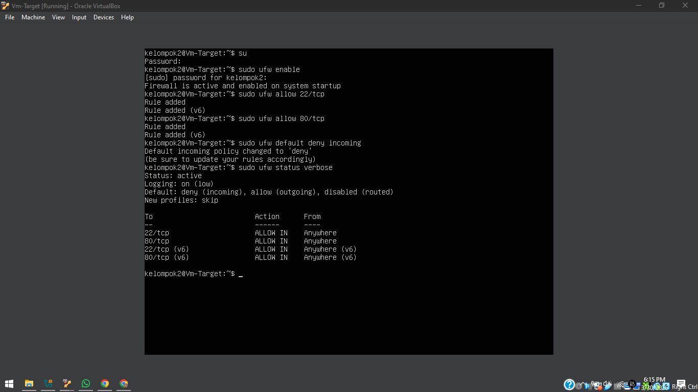
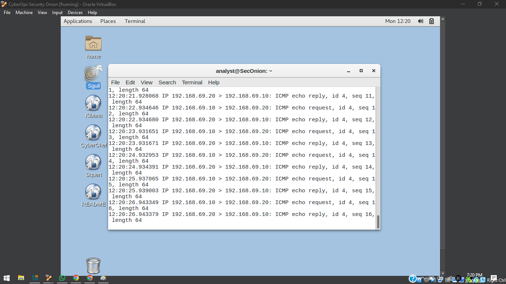

# Baseline Report (Fase 1: Hardening Review)

## 1. Identitas Sistem
* **Nama Kelompok**: Kelompok 2
* **Hostname Server Target**: SRV-WEB-KEL02F
* **IP Address Server**:  192.168.69.x
* **IP Address Attacker/Client**: 192.168.69.20 / 192.168.69.10

## 2. Topologi Jaringan

Hardening adalah proses memperkuat keamanan server dengan menutup celah-celah yang tidak diperlukan.
  Dalam konteks tugasmu:
    1. Server (Target) dikunci menggunakan Firewall (UFW) agar hanya pintu (port) penting saja yang terbuka.
    2. Security Onion bertindak sebagai "CCTV Jaringan" yang terhubung ke kabel virtual yang sama.
    3.Setiap data yang lewat (seperti Ping) akan "didengar" oleh Security Onion, dianalisis, dan dicatat sebagai log di Sguil/Squert sebagai bukti bahwa sistem pemantauanmu aktif.

## 3. System Hardening
Kami telah melakukan penguatan pada sistem operasi dengan langkah berikut:
1. **Penonaktifan Layanan**: Mematikan layanan [sebutkan layanan, misal: telnet/ftp] yang tidak diperlukan.
2. **Manajemen User**: Menonaktifkan login root langsung dan membuat user non-root bernama `[SRV-WEB-KEL02F]`.
3. **Security Patch**: Melakukan update OS ke versi patch terbaru.

## 4. Network Hardening (Firewall)
Kami menggunakan UFW (Uncomplicated Firewall) dengan konfigurasi Default Deny untuk incoming traffic.

## 5. Verifikasi Logging (Minggu ke-5)
Berikut adalah bukti bahwa Security Onion telah terinstal dan aktif merekam aktivitas jaringan.

* **Keterangan**: Gambar di atas menunjukkan *log* aktivitas ICMP (Ping) dari IP Attacker (`[IP Attacker]`) menuju IP Target (`[IP Target]`) beserta *timestamp*-nya.
